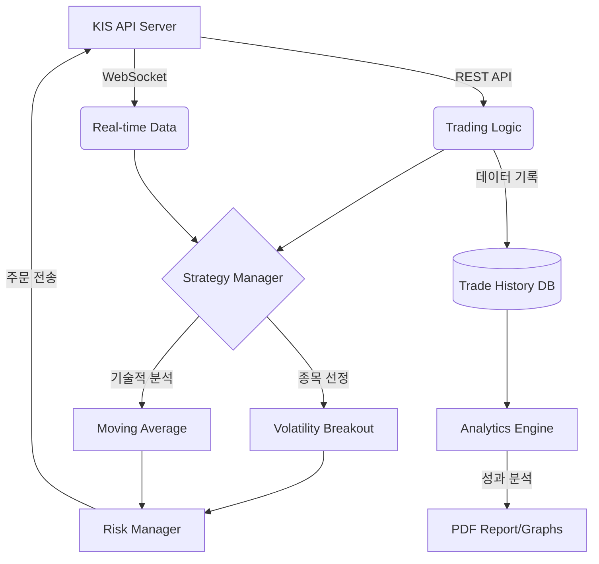

# KIS-based Stock Quant Trader (Korea Investment KIS API 🚀)

> 🎯 **목표: "1만원을 투자하여 1개월뒤에 10만원의 수익을 얻기 위한 것입니다."**
>
> **한국투자증권 KIS API 기반 크로스플랫폼(Ubuntu/Windows/macOS) 자동매매 프레임워크**
>
> 🌐 **공식 가이드 웹사이트**: [docs/index.html](docs/index.html) (브라우저로 열기)

## 🌌 프로젝트 명칭 및 철학 (Naming & Philosophy)

**Stock Quant Trader 🚀** 는 특정 증권사에 종속되지 않고, 리눅스(Ubuntu) 환경에서도 중단 없이 돌아가는 견고한 퀀트 시스템을 지향합니다.

- **Cross-Platform**: Windows에 갇혀있던 자동매매를 리눅스/클라우드 환경으로 확장합니다.
- **REST + WebSocket**: 현대적인 API 방식을 통해 안정적이고 빠른 데이터 수신과 주문 집행을 실현합니다.
- **Quant**: 인간의 주관적 감정을 배제하고, 수학적 모델과 데이터에 기반한 **계량 투자(Quantitative Analysis)**의 정교함을 추구합니다.
- **Trader**: 시장의 기회를 놓치지 않고 24시간 깨어있는 **자동 실행 엔진**으로서의 정체성을 나타냅니다.
- **Pro**: 단순 자동매매를 넘어 백테스트, AI 감성 분석, 통계 리포팅 등 **전문가 수준의 프레임워크**임을 뜻합니다.
- **🚀 (Rocket)**: 투자 수익의 폭발적인 성장과 기술적 혁신을 향한 끊임없는 도전을 상징합니다.

본 프로젝트는 개인 투자자도 기관 수준의 전략과 분석 시스템을 소유할 수 있도록 돕기 위해 탄생했습니다.

---

## 📊 증권사별 크로스플랫폼 호환성 비교

두 운영체제(Windows/Ubuntu)를 모두 지원하려면 REST API 기반 증권사가 핵심입니다.

| 증권사 | Windows | Ubuntu | API 방식 | 실시간 시세 | 모의투자 | 난이도 |
| :--- | :---: | :---: | :--- | :---: | :---: | :---: |
| **한국투자증권** | ✅ | ✅ | **REST + WebSocket** | ✅ | ✅ | **낮음** |
| 미래에셋증권 | ✅ | ✅ | REST | ✅ | ✅ | 중간 |
| 이베스트투자증권 | ✅ | ✅ | REST | ✅ | ✅ | 중간 |
| 키움증권 | ✅ | ❌ | OCX (Windows 전용) | ✅ | ✅ | 낮음 |
| 대신증권 CYBOS | ✅ | ❌ | COM (Windows 전용) | ✅ | ❌ | 높음 |

### 🏆 한국투자증권(KIS API)을 추천하는 이유
- **크로스플랫폼**: REST API라서 Windows·Ubuntu 동일한 코드 동작
- **공식 파이썬 SDK**: `pip install kis-developers` 한 줄로 설치 및 관리 가능
- **WebSocket 실시간 시세**: 자동매매의 핵심인 실시간 호가·체결 데이터 수신
- **모의투자 서버**: 실제 자금 투입 전 완벽한 전략 검증 가능
- **활발한 커뮤니티**: 국내 자동매매 개발자들 사이에서 가장 널리 사용됨

---

## 1. 시스템 아키텍처 (System Architecture)

본 시스템은 **이벤트 기반(Event-Driven)** 설계를 통해 데이터 수신과 주문 실행 사이의 지연 시간을 최소화합니다.



## 2. 실행 화면 (Screenshots)

### 실시간 매매 대시보드


### 퀀트 성과 분석 리포트


---

### 핵심 모듈 기능
- **Core Engine**: `kis-developers`를 이용한 한국투자증권 REST/WebSocket 통신 제어.
- **Strategy Manager**: **앙상블(Ensemble) 엔진** 탑재. 돌파, 평균회귀, 추세추종 전략의 가중 투표 방식 채택.
- **Risk Manager**: **글로벌 세이프 가드(Safe Guard)** 탑재. 나스닥 및 환율 추이에 따라 매매 비중 자동 조절.
- **Paper Trading Engine**: 실시간 호가 잔량 및 슬리피지를 반영한 정밀 가상 매매 시뮬레이터.
- **Ensemble Engine**: 전략별 실시간 성과를 추적하여 자산을 동적으로 배분.
- **Genetic Optimizer**: 유전 알고리즘을 통해 최적의 매매 파라미터($K$값 등)를 스스로 학습 및 진화.
- **Compound Manager**: **복리 자금 관리 엔진**. 수익금을 자동으로 재투자하여 자산 성장을 가속화.
- **Volatility Filter**: 거래대금이 폭발하는 **급등 주도주** 실시간 포착 엔진.
- **AI News Analyzer**: **Google Gemini API**를 연동하여 실시간 뉴스의 호재/악재를 점수화.
- **Analytics Engine**: 샤프 지수, MDD 및 **슬리피지 비용(Slippage Cost)** 분석 및 리포팅.

---

## 2. 탑재 전략: 변동성 돌파 (Volatility Breakout)

Larry Williams의 변동성 돌파 전략을 한국 시장에 최적화하여 구현하였습니다.

- **진입 조건**: 
    - `가격 > 전일 종가 + (전일 고가 - 전일 저가) * K` (K=0.5 추천)
    - 당일 거래량 > 전일 평균 거래량 * 1.5
- **청산 조건**: 당일 장마감 직전 전량 매도 (Overnight 최소화)
- **자금 관리**: 계좌 자산의 10% 이내 분할 진입

---

## 4. 시스템 요구 사양 (System Requirements)

- **지원 운영체제**: Ubuntu 20.04+, Debian, macOS, Windows 10/11
  - *Cloud VPS(AWS, GCP 등) Linux 환경 완벽 지원*
- **파이썬 버전**: Python 3.8 이상 (64-bit 지원)
- **네트워크**: 상시 인터넷 연결 필요

---

## 5. 설치 및 실행 가이드 (User Manual)

컴퓨터에 익숙하지 않은 초보자분들도 차근차근 따라 하면 설치할 수 있도록 구성하였습니다.

### 1단계: 파이썬 및 필수 패키지 설치 (Ubuntu 기준)
```bash
sudo apt update
sudo apt install python3 python3-pip git
```

### 2단계: 코드 다운로드 및 라이브러리 설치
```bash
git clone https://github.com/leemgs/stock-quant-trader.git
cd stock-quant-trader
pip install -r requirements.txt
```

### 3단계: 한국투자증권 API 신청
1. [한국투자증권 KIS Developers](https://apiportal.koreainvestment.com/) 접속
2. 앱 키(App Key) 및 앱 시크릿(App Secret) 발급
3. 모의투자 계좌 개설 (권장)

### 4단계: 설정 파일(config.yaml) 수정
`config.yaml` 파일을 열어 발급받은 키와 계좌 정보를 입력합니다.
```yaml
auth:
  kis_app_key: "발급받은_앱키"
  kis_app_secret: "발급받은_시크릿"
  kis_account_no: "계좌번호8자리"
  kis_virtual_trading: true # 모의투자시 true
```

### 5단계: 프로그램 실행
1. 아래 명령어로 프로그램을 실행합니다.
```bash
python3 main.py
```
2. 시스템 로그와 텔레그램 알림을 통해 작동 상태를 확인합니다.

---

## 6. 자동매매 운영 가이드 (Operation Guide)

본 시스템을 효율적으로 운영하기 위한 실전 가이드입니다.

### 1) 매매 시간 규정
- **감시 시작**: 오전 08:50 (시스템 로그인 및 데이터 수집 준비)
- **실제 매매**: 오전 09:00 ~ 오후 03:20
- **당일 청산**: 오후 03:20 이후 보유 종목 전량 매도 (기본 설정 시)
- *주의: 주말 및 공휴일에는 거래가 발생하지 않습니다.*

### 2) 전략 선택 및 변경
- 본 시스템은 기본적으로 **앙상블(Ensemble) 모드**로 작동합니다.
- `main.py`에서 `strategies` 딕셔너리를 수정하여 특정 전략만 가동하거나 새로운 전략을 추가할 수 있습니다.
- **AI 뉴스 분석**은 `config.yaml`에 Gemini API 키가 등록된 경우에만 활성화됩니다.

### 3) 모니터링 방법
- **텔레그램**: 매수/매도 발생 시 스마트폰으로 즉시 알림이 전송됩니다.
- **웹 대시보드**: `streamlit run monitor/dashboard.py`를 실행하여 실시간 수익률 곡선을 확인하세요.
- **로그 파일**: `logs/trading.log`에서 시스템의 모든 동작 상세 내역을 확인할 수 있습니다.

### 4) 실전 투자 전환 시 주의사항
1. 반드시 **모의투자** 환경에서 최소 1주일 이상 테스트하세요.
2. `config.yaml`의 `stop_loss`와 `max_stocks` 설정을 본인의 투자 성향에 맞게 조정하세요.
3. **투자 한도 설정**: `config.yaml`의 `max_budget` 항목을 통해 자동매매에 사용할 총액을 제한할 수 있습니다. (예: 계좌에 100만원이 있어도 50만원만 사용하도록 설정 가능)
4. 인터넷 연결이 끊기면 API 접속이 종료되므로, 가급적 유선 LAN 환경이나 VPS 사용을 권장합니다.

---

### 6단계: 실시간 모니터링 대시보드 실행
매매 현황을 웹 브라우저에서 시각적으로 확인하려면 새 터미널을 열고 아래 명령어를 입력하세요.
```bash
streamlit run monitor/dashboard.py
```
*실행 후 브라우저에서 `localhost:8501` 주소로 접속하면 대시보드가 나타납니다.*

---


## 6. 리포트 샘플 (Analytics)

시스템 실행 후 `reports/` 폴더에 다음과 같은 분석 자료가 자동 생성됩니다.
- **Performance Graph**: 누적 수익률 vs 벤치마크 (KOSPI/KOSDAQ)
- **Drawdown Chart**: 하락폭 분석을 통한 리스크 관리 지표
- **Advanced Statistical Report**: **p-value, T-test, Sharpe/Sortino Ratio**를 포함한 학술적 수준의 PDF 리포트
- **Slippage Impact Report**: 이론적 수익과 실거래 수익의 오차 원인 분석

---

## 7. 법적 고지 (Disclaimer)
본 소프트웨어를 통한 매매의 책임은 사용자 본인에게 있으며, 개발자는 발생한 손실에 대해 책임을 지지 않습니다. 충분한 모의투자를 권장합니다.

---

## 8. 고수익 달성 로드맵 (Roadmap to 1,000% Profit)

본 시스템은 소액(1만원)으로 10배 수익(10만원) 달성을 돕기 위한 특화 기능을 제공합니다. 
특히 1개월 내 10배 수익 목표 달성을 위해 **IonQ와 같은 양자 컴퓨터 관련주 등 비교적 우량하면서도 장중 변동성(fluctuation)이 심하고 빈번한 종목**을 타겟으로 자동매매 알고리즘이 특화 설계/구현되었습니다.

### 💰 10배 성장을 위한 3대 핵심 전략
1. **고변동성 우량주 타겟팅 (High Fluctuation Targeting)**: 양자 컴퓨팅(ex. IonQ) 등 미래 유망 섹터 중 펀더멘털이 비교적 우량하면서도 장중 잦은 변동성을 보이는 종목을 집중 타겟팅하여 단기 차익을 극대화합니다.
2. **복리의 극대화 (Compounding)**: `CompoundManager`를 활성화하여 수익이 발생할 때마다 매수 강도를 높이세요.
3. **초단기 손절의 기계화 (Protection)**: 고변동성 종목을 다루는 만큼 -1.5% 손절선을 기계적으로 엄격히 준수하여 원금 파손을 방지하세요.

### 운영 팁
- **장초반 30분**: 모든 수익의 80%는 개장 직후에 발생합니다. `VolatilityFilter`가 잡은 종목에 집중하세요.
- **분산보다 집중**: 자본금이 5만원 미만일 때는 가급적 1~2종목에 집중 투자하는 것이 유리합니다.

### 시스템적 개선 포인트
1. **회전율 극대화**: 하루 한 번 매매가 아닌, 하루에도 수십 번 시그널을 포착하는 `AdvancedBreakout` 스캘핑 모드를 활용하세요.
2. **조건검색식 최적화**: 거래대금이 전일 대비 최소 500% 이상 폭증하는 종목(소위 '돈이 몰리는 종목')만 매수하도록 필터링을 강화했습니다.
3. **손절의 기계화**: 1,000% 수익을 위해서는 큰 손실 한 번이 치명적입니다. 시스템에 구현된 **-1.5% 강제 손절** 기능을 절대 수정하지 마세요.
4. **동적 K-값 활용**: 시장 상황에 따라 진입 장벽(K-Value)을 낮추거나 높여 기회비용을 최소화합니다.

### 운영 노하우
- **장초반 30분 집중**: 한국 시장의 변동성 80%는 오전 9시~9시 30분에 발생합니다. 이 시간에 시스템이 집중적으로 매매하도록 설정하세요.
- **미수/신용 활용 (주의)**: 소액(1만원)으로 단기간 고수익을 내려면 한국투자증권의 증거금률을 활용하여 레버리지를 극대화해야 합니다. (단, 원금 초과 손실 위험이 있으니 반드시 모의투자 후 실행하세요.)
- **서버 안정성**: 0.1초의 지연도 수익률에 영향을 줍니다. 가정용 PC보다는 **AWS 또는 가비아 등의 Windows VPS** 환경에서 24시간 가동하는 것을 권장합니다.

### 🛠️ 고수익 도전용 추천 설정 (config.yaml)
소액으로 10배 수익을 노릴 때 가장 효율적인 세팅값입니다.
```yaml
trading:
  max_budget: 10000     # 초기 자본금 전액 활용
  stop_loss: 0.015      # -1.5%에서 칼같이 손절 (원금 보존)
  take_profit: 0.03     # +3.0%에서 1차 익절 (회전율 극대화)
  k_value: 0.4          # 진입 장벽을 낮춰 더 많은 기회 포착
  max_stocks: 1         # 소액일수록 1종목에 집중 (집중 투자)
```

---

## 9. 참고문헌 (References)

본 프로젝트의 아키텍처 및 전략 설계에 참고한 주요 자료입니다.

### 공식 리소스
- [한국투자증권 KIS Developers 공식 가이드라인](https://apiportal.koreainvestment.com/)
- [한국투자증권 상시 모의투자 서비스 안내](https://securities.koreainvestment.com/main/mall/mock/MockIntro.jsp)

### 관련 연구 논문
- Williams, L. (1999). *Long-Term Secrets to Short-Term Trading*. Wiley. (변동성 돌파 전략의 기초)
- Sharpe, W. F. (1994). *The Sharpe Ratio*. Journal of Portfolio Management. (성능 검증 지표)
- Fischer, T., & Krauss, C. (2018). *Deep learning with long short-term memory networks for financial market predictions*. European Journal of Operational Research. (AI 전략 설계 참고)
- Fama, E. F., & French, K. R. (1993). *Common risk factors in the returns on stocks and bonds*. Journal of Financial Economics. (팩터 투자 및 다요인 모델의 기초)
- Kelly, J. L. (1956). *A New Interpretation of Information Rate*. Bell System Technical Journal. (켈리 공식 기반 최적 자금 관리 및 베팅 사이즈 설정)
- Jegadeesh, N., & Titman, S. (1993). *Returns to Buying Winners and Selling Losers: Implications for Stock Market Efficiency*. The Journal of Finance. (추세 추종 및 모멘텀 전략)
- Mandelbrot, B. (1963). *The Variation of Certain Speculative Prices*. The Journal of Business. (금융 자산의 팻테일(Fat-tail) 현상과 극단적 변동성 분석)
- Dixon, M. F., Halperin, I., & Bilokon, P. (2020). *Machine Learning in Finance: From Theory to Practice*. Springer. (금융 데이터를 활용한 딥러닝/머신러닝 알고리즘 실무)
- Lo, A. W., & MacKinlay, A. C. (1999). *A Non-Random Walk Down Wall Street*. Princeton University Press. (시장 미시구조 및 통계적 차익거래 기회 분석)

### 실무적 참고 사이트
- [QuantConnect](https://www.quantconnect.com/): 글로벌 퀀트 알고리즘 프레임워크 참고
- [Systrader79의 퀀트 투자 블로그](https://blog.naver.com/systrader79): 한국 시장 자산 배분 전략 참고
- [파이썬으로 배우는 알고리즘 트레이딩](https://wikidocs.net/book/110): KIS API 파이썬 연동 기초

---

## ⚠️ 면책 조항 및 투자 위험 고지 (Disclaimer)

> **본 프로젝트(Stock Quant Trader)는 "1개월 내 10배 수익" 등 어떠한 형태의 특정 수익률 달성도 절대 보장하지 않습니다.**

본 소프트웨어에서 제공하는 매매 시그널, 종목 포착(IonQ 등 고변동성 종목 포함) 및 모든 알고리즘 로직은 참고용 정보일 뿐이며, 기술적 오류나 시장의 급격한 변동으로 인해 예기치 못한 **막대한 원금 손실**이 발생할 수 있습니다. 

본 앱의 사용(실계좌 자동매매 연동 포함)으로 인해 발생하는 **모든 금전적 손실과 법적 책임은 전적으로 사용자 본인에게** 있습니다. 사용자는 이 시스템이 수익을 마법처럼 보장해 주지 않는다는 점을 명확히 인지하고, 반드시 충분한 기간 동안의 모의투자를 통해 리스크를 검증한 후 전적으로 본인의 판단과 책임하에 운용해야 합니다.
