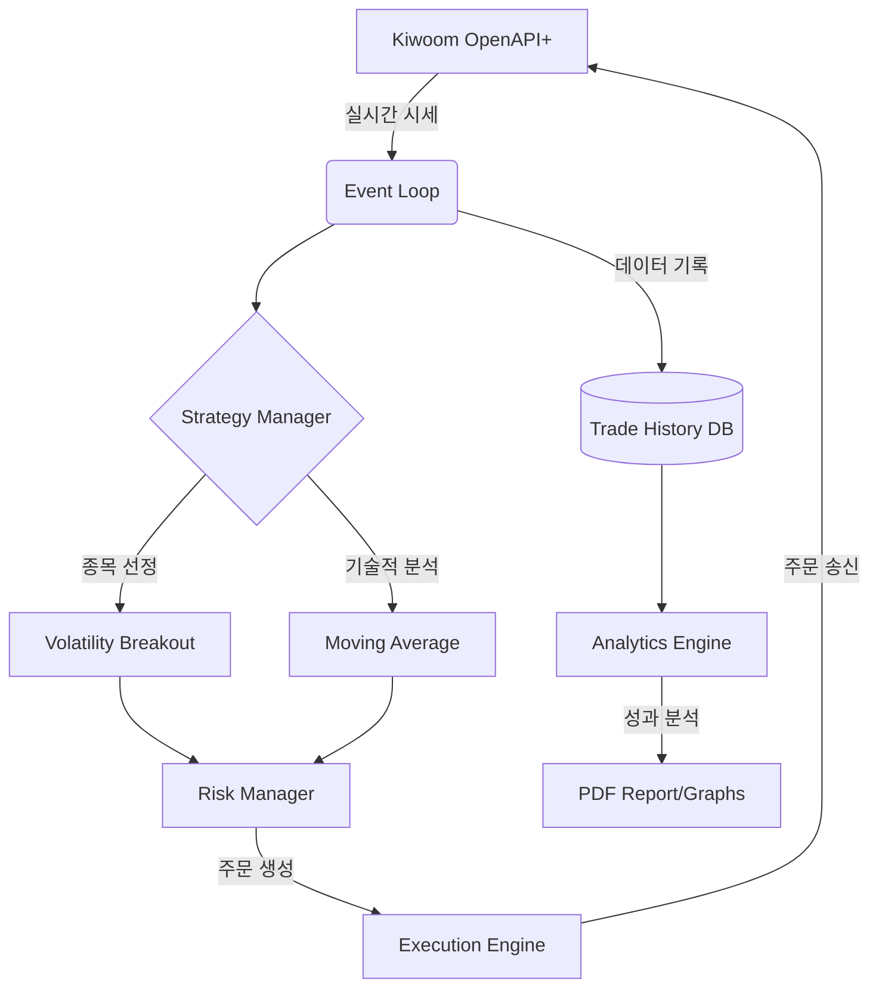
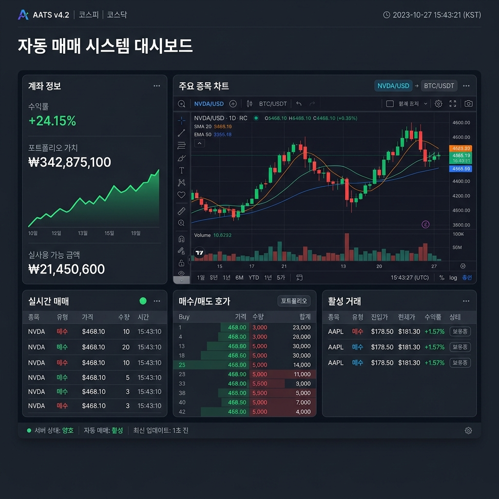
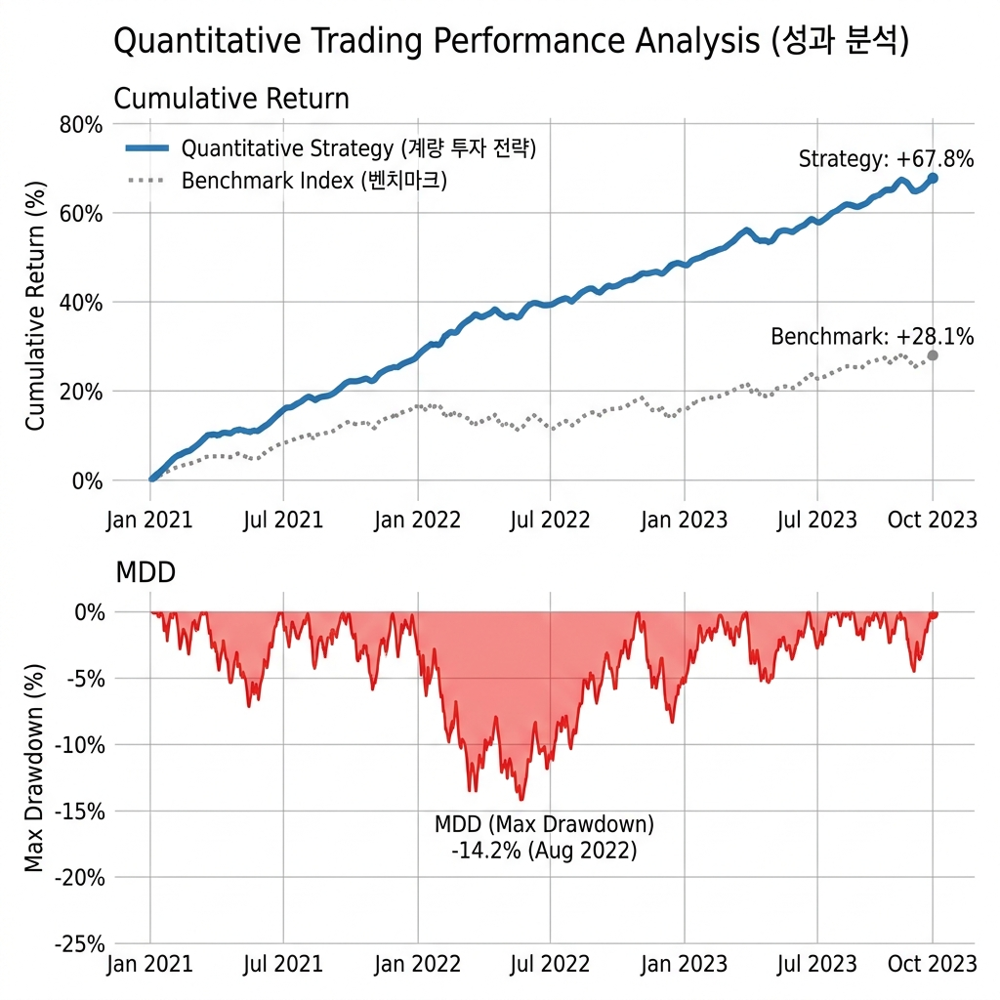

# Kiwoom Quant Trader Pro 🚀

> **키움증권 API 기반 실전 자동매매 및 성과 분석 프레임워크**

본 프로젝트는 개인 투자자를 위한 전문적인 퀀트 매매 시스템으로, 단순 매매를 넘어 **백테스트-실거래-성과 분석**의 선순환 구조를 제공합니다.

---

## 1. 시스템 아키텍처 (System Architecture)

본 시스템은 **이벤트 기반(Event-Driven)** 설계를 통해 데이터 수신과 주문 실행 사이의 지연 시간을 최소화합니다.



## 2. 실행 화면 (Screenshots)

### 실시간 매매 대시보드


### 퀀트 성과 분석 리포트


---

### 핵심 모듈 기능
- **Core Engine**: `QAxWidget`을 이용한 Kiwoom COM 객체 제어 및 재접속 관리.
- **Strategy Manager**: **앙상블(Ensemble) 엔진** 탑재. 돌파, 평균회귀, 추세추종 전략의 가중 투표 방식 채택.
- **Risk Manager**: 고정 비중법(Fixed Fractional) 및 ATR 기반 손절 적용.
- **Ensemble Engine**: 전략별 실시간 성과를 추적하여 자산을 동적으로 배분.
- **AI News Analyzer**: **Google Gemini API**를 연동하여 실시간 뉴스의 호재/악재를 점수화.
- **Analytics Engine**: 샤프 지수(Sharpe Ratio), MDD(최대 낙폭) 계산 및 리포팅.

---

## 2. 탑재 전략: 변동성 돌파 (Volatility Breakout)

Larry Williams의 변동성 돌파 전략을 한국 시장에 최적화하여 구현하였습니다.

- **진입 조건**: 
    - `가격 > 전일 종가 + (전일 고가 - 전일 저가) * K` (K=0.5 추천)
    - 당일 거래량 > 전일 평균 거래량 * 1.5
- **청산 조건**: 당일 장마감 직전 전량 매도 (Overnight 최소화)
- **자금 관리**: 계좌 자산의 10% 이내 분할 진입

---

## 4. 시스템 요구 사양 (System Requirements)

본 프로그램은 키움증권 OpenAPI+의 기술적 제약으로 인해 아래 환경에서만 작동합니다.

- **지원 운영체제**: Windows 10, Windows 11 (64-bit 권장)
  - *macOS, Linux(Ubuntu 등)는 지원하지 않습니다.*
- **파이썬 버전**: Python 3.8 ~ 3.10 (**반드시 32-bit(x86) 버전 필요**)
- **네트워크**: 상시 인터넷 연결 필요 (안정적인 유선 랜 권장)

---

## 5. 설치 및 실행 가이드 (User Manual)

컴퓨터에 익숙하지 않은 초보자분들도 차근차근 따라 하면 설치할 수 있도록 구성하였습니다.

### 1단계: 파이썬(Python) 설치
키움증권 API는 **32비트** 환경에서만 작동합니다. 반드시 아래 순서대로 설치하세요.
1. [Python 공식 홈페이지](https://www.python.org/downloads/windows/)에 접속합니다.
2. **Python 3.8 (또는 3.9) - 32-bit (x86)** 버전을 찾습니다. (64-bit는 작동하지 않으니 주의하세요!)
3. 설치 시 반드시 하단의 **[Add Python to PATH]** 체크박스를 클릭하고 설치를 진행하세요.

### 2단계: Git 설치 및 코드 다운로드
1. [Git 공식 홈페이지](https://git-scm.com/download/win)에서 설치 파일을 다운로드하여 기본 설정으로 설치합니다.
2. 키보드의 `Windows 키 + R`을 누르고 `cmd`라고 입력한 뒤 엔터를 칩니다.
3. 검은색 창(명령 프롬프트)이 뜨면 아래 명령어를 한 줄씩 복사해서 붙여넣고 엔터를 누릅니다.
   ```bash
   git clone https://github.com/leemgs/kiwoom-quant-trader.git
   cd kiwoom-quant-trader
   ```

### 3단계: 키움증권 OpenAPI+ 신청 및 설치
1. [키움증권 홈페이지 - OpenAPI+](https://www.kiwoom.com/h/customer/download/VOpenApiInfoView) 메뉴에서 '서비스 신청'을 합니다.
2. **OpenAPI+ 모듈**을 다운로드하여 설치합니다.
3. **상시 모의투자**를 신청하여 실제 돈이 나가기 전에 충분히 테스트해 보세요. (추천)

### 4단계: 필요한 라이브러리 설치
명령 프롬프트(검은 창)가 여전히 `kiwoom-quant-trader` 폴더 안에 있는 상태에서 아래 명령어를 입력합니다.
```bash
pip install -r requirements.txt
```
*오류가 날 경우 `pip install --upgrade pip`를 먼저 실행해 보세요.*

### 5단계: 프로그램 실행
1. `config.yaml` 파일을 메모장으로 열어 본인의 키움증권 ID와 계좌번호를 입력합니다.
2. 아래 명령어로 프로그램을 실행합니다.
```bash
python main.py
```
3. 실행 후 나타나는 키움증권 로그인 창에서 로그인하면 자동매매 감시가 시작됩니다.

### 6단계: 실시간 모니터링 대시보드 실행
매매 현황을 웹 브라우저에서 시각적으로 확인하려면 새 터미널을 열고 아래 명령어를 입력하세요.
```bash
streamlit run monitor/dashboard.py
```
*실행 후 브라우저에서 `localhost:8501` 주소로 접속하면 대시보드가 나타납니다.*

---

## 6. 리포트 샘플 (Analytics)

시스템 실행 후 `reports/` 폴더에 다음과 같은 분석 자료가 자동 생성됩니다.
- **Performance Graph**: 누적 수익률 vs 벤치마크 (KOSPI/KOSDAQ)
- **Drawdown Chart**: 하락폭 분석을 통한 리스크 관리 지표
- **Thesis Report**: 전략의 통계적 유의성 및 백테스트 결과 리포트 (PDF)

---

## 7. 법적 고지 (Disclaimer)
본 소프트웨어를 통한 매매의 책임은 사용자 본인에게 있으며, 개발자는 발생한 손실에 대해 책임을 지지 않습니다. 충분한 모의투자를 권장합니다.

---

## 8. 수익 극대화 가이드 (1,000% 수익 도전)

1만원으로 10만원의 수익을 내는 '10배 성과'를 위해서는 일반적인 매매 방식과는 다른 접근이 필요합니다.

### 시스템적 개선 포인트
1. **회전율 극대화**: 하루 한 번 매매가 아닌, 하루에도 수십 번 시그널을 포착하는 `AdvancedBreakout` 스캘핑 모드를 활용하세요.
2. **조건검색식 최적화**: 거래대금이 전일 대비 최소 500% 이상 폭증하는 종목(소위 '돈이 몰리는 종목')만 매수하도록 필터링을 강화했습니다.
3. **손절의 기계화**: 1,000% 수익을 위해서는 큰 손실 한 번이 치명적입니다. 시스템에 구현된 **-1.5% 강제 손절** 기능을 절대 수정하지 마세요.
4. **동적 K-값 활용**: 시장 상황에 따라 진입 장벽(K-Value)을 낮추거나 높여 기회비용을 최소화합니다.

### 운영 노하우
- **장초반 30분 집중**: 한국 시장의 변동성 80%는 오전 9시~9시 30분에 발생합니다. 이 시간에 시스템이 집중적으로 매매하도록 설정하세요.
- **미수/신용 활용 (주의)**: 소액(1만원)으로 단기간 고수익을 내려면 키움증권의 증거금률을 활용하여 레버리지를 극대화해야 합니다. (단, 원금 초과 손실 위험이 있으니 반드시 모의투자 후 실행하세요.)
- **서버 안정성**: 0.1초의 지연도 수익률에 영향을 줍니다. 가정용 PC보다는 **AWS 또는 가비아 등의 Windows VPS** 환경에서 24시간 가동하는 것을 권장합니다.
